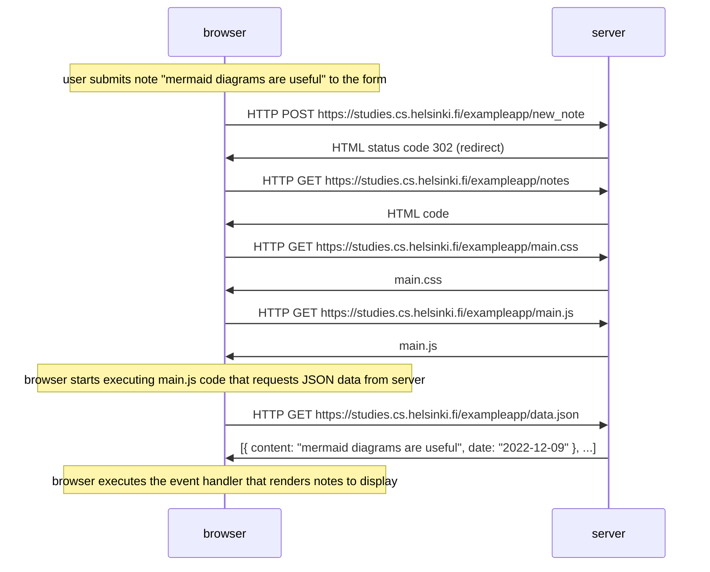

```mermaid
sequenceDiagram
    participant browser
    participant server

    note over browser: user submits note "mermaid diagrams are useful" to the form

    browser->>server: HTTP POST https://studies.cs.helsinki.fi/exampleapp/new_note
    server->>browser: HTML status code 302 (redirect)
    browser->>server: HTTP GET https://studies.cs.helsinki.fi/exampleapp/notes
    server->>browser: HTML code


    browser->>server: HTTP GET https://studies.cs.helsinki.fi/exampleapp/main.css
    server->>browser: main.css

    browser->>server: HTTP GET https://studies.cs.helsinki.fi/exampleapp/main.js
    server->>browser: main.js

    note over browser: browser starts executing main.js code that requests JSON data from server

    browser->>server: HTTP GET https://studies.cs.helsinki.fi/exampleapp/data.json
    server->>browser: [{ content: "mermaid diagrams are useful", date: "2022-12-09" }, ...]

    note over browser: browser executes the event handler that renders notes to display
```
